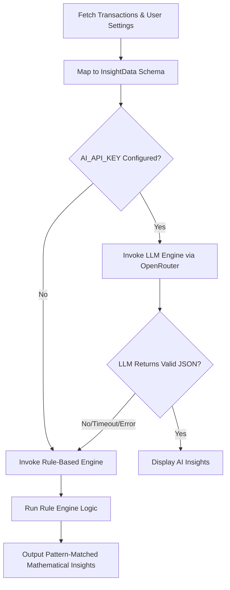

# Aura Moni (Finance Web & Mobile App) - Technical Blueprint & Documentation

Aura Moni is a premium, smart personal finance management application designed for high performance, ease of use, and visual excellence. Built using Next.js 16 (App Router), React 19, Supabase, and dynamic AI insights, it works seamlessly as a standalone web application and is highly optimized to run as a hybrid application inside a Flutter WebView wrapper.

---

## 🛠️ Technology Stack & Libraries

- **Framework**: Next.js 16 (App Router) + React 19 + TypeScript.
- **Database & Auth**: Supabase (PostgreSQL), direct RPC calls, and custom server-side JWT auth via cookies.
- **Styling & UI**: Tailwind CSS v4, Ant Design (antd) v6, Lucide Icons, and Framer Motion for premium micro-animations.
- **Visualization**: Recharts for interactive financial charts and trends.
- **AI Engine**: OpenRouter integration for intelligent financial advice with automated mathematical fallback rules.
- **Integration Layer**: Hybrid Flutter InAppWebView javascript bridging (`flutter_inappwebview` handler).

---

## 📂 Project Directory Structure

```text
├── .agents/                    # Agent-specific prompt instructions and memories
├── src/
│   ├── app/                    # Next.js App Router (pages, actions, routing)
│   │   ├── account/            # User account metadata & settings
│   │   ├── auth/               # Server-side auth server actions
│   │   ├── dashboard/          # Finance dashboard, key metrics, charts, AI advice
│   │   ├── login/              # Sign In screen
│   │   ├── signup/             # Sign Up screen
│   │   ├── reports/            # Deep-dive expense categories & comparison reports
│   │   ├── settings/           # Custom thresholds, configurations
│   │   ├── transactions/       # Add, edit, remove, view, and search transactions
│   │   ├── globals.css         # Styling base & custom animations
│   │   ├── layout.tsx          # App container & user authentication context fetch
│   │   └── page.tsx            # Main landing or landing-redirect entrypoint
│   ├── components/             # Reusable UI widgets
│   │   ├── flutter-handler.tsx # Custom window listener hook for Flutter hardware integration
│   │   ├── ai-advisor.tsx      # Interactive AI/Rule-based financial advice container
│   │   ├── sidebar.tsx         # Responsive desktop sidebar drawer
│   │   └── bottom-nav.tsx      # Premium mobile tab navigation bar
│   ├── constants/              # Categories, transaction types, custom static arrays
│   ├── lib/
│   │   └── insights/           # Multi-engine financial advisor pipeline
│   │       ├── index.ts        # Insights Orchestrator (tries LLM -> falls back to Rule Engine)
│   │       ├── llm-engine.ts   # OpenRouter GPT/Claude agent for detailed spend analyses
│   │       ├── rule-engine.ts  # Math rules (Limit warnings, Daily spending speed, Month-over-month increases)
│   │       └── types.ts        # TypeScript schemas and data contracts
│   └── utils/                  # Helper modules
│       ├── auth.ts             # JWT generation and verification using `jose`
│       └── supabase/           # Server-side Supabase client initializers
│           ├── admin.ts        # Service role client (for backend mutations bypass)
│           └── server.ts       # Server-component Supabase initializer
├── supabase/                   # Database schemas and setup migration scripts
│   ├── table.sql               # Base tables creation (users, transactions)
│   └── migration_add_indexes_and_rpc.sql # Optimal indices, DB triggers, and reporting RPCs
```

---

## 🗄️ Database Architecture & Schemas

### 1. Bảng Users (`public.users`)
Stores user profiles, credentials (hashed via `bcryptjs`), and account metadata limits.
```sql
CREATE TABLE public.users (
  id UUID DEFAULT gen_random_uuid() PRIMARY KEY,
  email TEXT UNIQUE NOT NULL,
  password_hash TEXT NOT NULL,
  full_name TEXT,
  avatar_url TEXT,
  metadata JSONB DEFAULT '{"dailyLimit": null, "monthlyLimit": null}'::jsonb,
  created_at TIMESTAMP WITH TIME ZONE DEFAULT timezone('utc'::text, now()) NOT NULL,
  updated_at TIMESTAMP WITH TIME ZONE DEFAULT timezone('utc'::text, now()) NOT NULL
);
```

### 2. Bảng Transactions (`public.transactions`)
Stores transaction history, categorized into `income` (Thu) and `expense` (Chi).
```sql
CREATE TABLE public.transactions (
  id UUID DEFAULT gen_random_uuid() PRIMARY KEY,
  user_id UUID REFERENCES public.users(id) ON DELETE CASCADE NOT NULL,
  type TEXT NOT NULL CHECK (type IN ('income', 'expense')),
  title TEXT NOT NULL,
  category TEXT NOT NULL,
  amount NUMERIC NOT NULL,
  transaction_date TIMESTAMP WITH TIME ZONE DEFAULT timezone('utc'::text, now()) NOT NULL,
  description TEXT,
  created_at TIMESTAMP WITH TIME ZONE DEFAULT timezone('utc'::text, now()) NOT NULL,
  updated_at TIMESTAMP WITH TIME ZONE DEFAULT timezone('utc'::text, now()) NOT NULL
);

-- Compound Index optimized for user dashboard & transactions filtering
CREATE INDEX idx_transactions_user_date ON public.transactions(user_id, transaction_date DESC);
```

---

## 🔄 Architectural Subsystems

### 🛡️ Authentication Architecture
- **Password Protection**: Salted hash validation using `bcryptjs` 10-rounds on user sign-up/password changes.
- **Session Layer**: A custom JWT token generated with high-speed cryptographic signatures via `jose` (`HS256`).
- **Cookie-Based State**: The JWT token is wrapped inside a secure HttpOnly cookie (`auth_token`), keeping the user logged in across server actions and page loads seamlessly.
- **Server Actions**: Authentication is conducted entirely in `src/app/auth/actions.ts` via server-side routines (`signIn`, `signUp`, `signOut`, `updateProfile`), minimizing Client JavaScript footprint and ensuring secure, reliable authentication.

### 🧠 The Intelligent Insights Pipeline (`src/lib/insights`)
The core value-add component is the intelligent financial feedback loop. It runs on a dual-engine architectural pattern:



1. **LLM Engine (`llm-engine.ts`)**: Uses custom prompt injection mapping historical cash-flow logs, current limits, and monthly spending profiles. Calls OpenRouter API to fetch JSON-encoded, actionable insights.
2. **Rule Engine (`rule-engine.ts`)**: Serves as the high-availability failover. It mathematically analyzes the `InsightData` object to generate warning levels:
   - **Monthly Spend Limit**: Triggers at `> 80%` and `> 100%` budgets.
   - **Daily Burn Rate**: Warns if current daily spending exceeds the average budget remaining.
   - **Month-Over-Month Variance**: Flags severe jumps in spending for specific categories (e.g. food, shopping) compared to the previous month.
   - **Empty State**: Prompt to input the first transactions.

### 📱 Hybrid Flutter WebView Integration (`flutter-handler.tsx`)
Aura Moni is perfectly optimized for wrapping into Flutter shell apps via InAppWebView. Key features:
- **System Back Button Control**: Intercepts physical back button presses (`flutterBackButtonPressed` events) dispatched from Flutter.
- **Overlay & Modal Safety**: If an Ant Design modal or overlay is open, the back press closes the modal immediately first instead of popping the application routes.
- **Dynamic Routing Pop**: Smoothly routes backwards relative to URL path hierarchy levels (e.g. `/account/security` -> `/account` -> `/`). If it is already on the homepage base path, it instructs the Flutter Host wrapper to exit/minimize the application via standard `Window.flutter_inappwebview` message handlers.

---

## 🚀 Installation & Local Environment

Follow these steps to run Aura Moni on your local machine:

### 1. Install Dependencies
```bash
npm install
```

### 2. Configure Environment Variables
Create a file named `.env.local` in the root directory and define the following variables:
```env
SUPABASE_URL=https://your-project-id.supabase.co
SUPABASE_ANON_KEY=your-anon-public-key
SUPABASE_SERVICE_ROLE_KEY=your-service-role-key-for-auth-bypass
JWT_SECRET=your-secure-jwt-encryption-key
AUTH_COOKIE_MAX_AGE=604800
AI_API_KEY=sk-or-v1-... # (Optional) OpenRouter key for AI Advisor
```

### 3. Setup Supabase Database
1. Create a free project on [Supabase Dashboard](https://supabase.com).
2. Open the **SQL Editor**, paste the contents of `supabase/table.sql` and click **Run**.
3. Open a second **SQL Editor** window, paste the contents of `supabase/migration_add_indexes_and_rpc.sql` and click **Run**.

### 4. Run Development Server
```bash
npm run dev
```
Open **[http://localhost:3000](http://localhost:3000)** on your browser to view the application.
